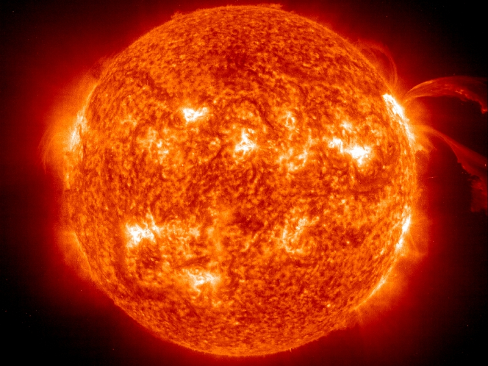

# Soleil

Le soleil est l'étoile autour de laquelle tourne la Terre.

## Caractéristiques

- Masse : 1.9885 x 1030 kg
- Diamètre : 1 392 684 km
- Composition :
  - Hydrogène : 73.46 %
  - Helium : 24.85 %
  - Oxygène : 0.77%
